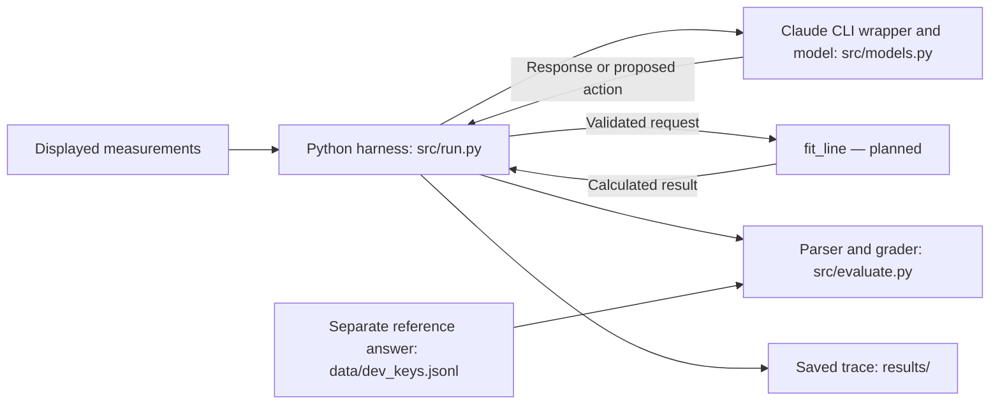

# EXPERIMENT.md — FROZEN for the V0 scored pilot (2026-09-21)

Status: frozen at 19:30 BST on 2026-09-21, after Leo approved D1–D10 with amendments (section 13). The frozen files and settings are fixed by `data/freeze_manifest.json`, which the runner checks before any scored call. Earlier text below keeps its development-stage notes for the record; where it conflicts with section 13, section 13 governs.

## 1. Question (V0)

On synthetic velocity–time measurements, how does a bounded line-fit workflow compare with a direct answer for estimating signed acceleration in m/s²?

This narrower question supersedes the open-weight-vs-frontier question in WORKMODE.md for V0. A local open-weight system is optional, not required.

## 2. Task family

One family: given a table of (t [s], v [m/s]) pairs, report the signed acceleration in m/s².

- Development cases: 4 (`dev-01`…`dev-04`). Used for building and debugging. May be viewed freely.
- Scored cases: 12 (`s-01`…`s-12`). Generated from a separate seed. Not shown to any model, and their responses are not inspected, until the freeze record is committed.
- Answer keys are stored in a file separate from the prompts, outside any directory a model-run working directory can read.

## 3. Generation method

For each case: draw a true acceleration `a_true` and initial velocity `v0`; set `v_i = v0 + a_true * t_i + ε_i`, `ε_i ~ N(0, σ²)`; round `v_i` to the displayed precision.

| Parameter | Proposed | Leo's decision |
|---|---|---|
| Seed (dev / scored) | two different integers | 101 (dev) / 202 (scored) |
| Points per case N | 8–12 | 10 |
| Time grid | uniform, t = 0…(N−1)·Δt, Δt = 0.5 s | t = 0, 0.5, …, 4.5 s; the same for every case |
| `a_true` range | uniform on [−5, 5] m/s², not rounded to a "nice" value; include negative cases in both splits | Continuous in ±(0, 5] m/s², not rounded. Sign-balanced by sampling within each sign: 2 positive / 2 negative dev, 6 / 6 scored. No magnitude floor or redraw rule (Leo, D3 amendment). Generating signs are balanced; the fitted reference need not share the sign |
| `v0` range | uniform on [−10, 10] m/s | Uniform on [−10, 10] m/s (nonzero intercept allowed) |
| Noise σ | set with tolerance (section 7) | 0.5 m/s, final (D1). At 0.5 m/s, SD(a_ref about a_true) = σ/√20.625 s² ≈ 0.11 m/s² |
| Displayed velocity precision | 2 decimals | 2 decimals; the reference is computed from exactly the displayed values |

Provenance: Leo made these decisions in chat. Claude entered them here at Leo's direction on 2026-09-21. Sxx = 20.625 s² was supplied by Codex and rechecked by Claude with python3.

Implementation: `src/tasks.py`, written by Claude at Leo's direction. It uses one `random.Random(seed)` per split and runs on Python 3.11.5.
- Draw order per case: |a_true| = 5·(1 − random()), which lies in (0, 5]; v0 = −10 + 20·random(); then one `gauss(0, σ)` per time point.
- Development sign order: dev-01 −, dev-02 +, dev-03 −, dev-04 +.
- Cases hold only the displayed strings. Keys are in a separate file.
- Development files are regenerated whenever σ changes. Scored cases are not generated until the freeze.

## 4. Reference answer

Reference = ordinary least-squares slope of the **displayed (rounded)** velocities against the displayed times:

`a_ref = Σ (t_i − t̄)(v_i − v̄) / Σ (t_i − t̄)²`, units m/s².

Not `a_true`. The model sees only the displayed table; the key must be a function of exactly that table. Sign convention: positive means velocity increases with time.

Independent check before scoring: compute `a_ref` for every case two ways (hand-written closed form and `statistics.linear_regression`), and hand-check at least one dev case, including one with negative slope.

## 5. Output protocol (application-level JSON, not native function calling)

Final answer, both conditions: `{"type": "final", "acceleration": <number>, "units": "m/s^2"}`

Accepted unit strings: `m/s^2`, `m/s²`, `m s^-2` (Leo, 2026-09-21). Anything else is a units failure.

Direct-condition prompt: `prompts/direct.txt` (approved by Leo, 2026-09-21; template SHA-256 `701dcfe4f6af1ff87680060436e8dffdc918770122a26e135f5af7d1b696e7f8`). It asks explicitly for the least-squares slope and shows only the displayed table.

Workflow tool request: `{"type": "tool", "name": "fit_line", "arguments": {"case_id": "<current case>"}}`. `fit_line` is the only allowlisted tool. It returns the slope and intercept of the least-squares line.

- Decided (Leo, 2026-09-21): the model names the current case ID, and the harness supplies that case's displayed measurements, never the answer key.
- A request with another case ID, another tool name or other arguments is not executed. The episode ends with `invalid_tool_request`, scored incorrect (Claude's implementation choice; for approval in section 13).
- Workflow prompts: `prompts/workflow_turn1.txt` (SHA-256 `b8f6ce40b8a8d00de25fb1562918451c05c0b65dd3bbd297f634d1588d0c0caf`) and `prompts/workflow_turn2.txt` (SHA-256 `e5582c10a5fd0f9a05e2d582fead3b69c287271daf80a3bc1d3ff71ff59b0e86`), drafted by Claude.

Parsing: exactly one JSON object in the response; no repair, no retry on malformed output. Malformed output is recorded and scored incorrect.

## 6. Conditions and episode limits

| | Direct | Bounded workflow |
|---|---|---|
| Model turns | 1 | ≤ 2 |
| Tool calls | 0 | ≤ 1 (`fit_line` only) |
| Native CLI tools (shell, file read, web) | disabled, verified in trace | disabled, verified in trace |
| Session state | fresh per episode | fresh per episode |
| Working directory | empty temp dir, no data/keys/code | same |

Claude CLI invocation used for development episodes (`src/models.py`):
- Command: `claude --print --model claude-opus-5 --tools "" --safe-mode --strict-mcp-config --no-session-persistence --output-format stream-json --verbose`.
- The prompt goes on stdin; each episode runs in a fresh empty temporary directory.
- Effort: development episodes used the CLI default. From the freeze on, `--effort high` is pinned (D6). The installed CLI lists `high` as a valid value. An invalid value is **not** rejected: the CLI prints a stderr warning, falls back to the default and still calls the model (observed 19:27 with `bogus`). So the runner treats any stderr output as a control violation. The trace doesn't echo the effort level, so the setting can't be confirmed from traces, only the absence of the warning.

Second turn mechanics, decided (Leo, 2026-09-21): a fresh CLI invocation whose prompt contains three things: the original task, the model's previous public JSON reply (not its hidden reasoning), and the tool result. Implemented in `src/agent.py`.

Limits (Leo): at most 2 model calls and 1 tool execution per episode, with no retries. If turn 1 returns a final answer, the episode ends after 1 call and 0 tool executions, and is graded as usual. If turn 2 requests another tool, the outcome is `tool_limit_exceeded`, scored incorrect.

Transport failures: no retries (D5). A call that returns no usable output is `missing_output`, scored incorrect and kept in the denominator. If a rate-limit status is not "allowed", the batch stops; the remaining episodes stay unattempted and are listed as such.

Control enforcement (added after Codex's review, before freeze): a call whose initialization metadata is missing or unexpected (model, `tools: []`, `mcp_servers: []`, CLI version), or that shows native tool use, overage or any stderr output, makes the episode `invalid_run`. It is not graded, stays in the denominator as not correct, and is categorised as a harness/control failure, distinct from a wrong answer. It also stops the batch.

## 7. Scoring

Correct iff: output parses, units accepted, and `|answer − a_ref| ≤ tol`.

Development tolerance: absolute 0.01 m/s², set provisionally (Leo, 2026-09-21) and frozen unchanged for scored runs (D2).

Scored tolerance: absolute ±0.01 m/s² (D2). It allows a 2-decimal answer. The endpoint shortcut differs from the least-squares slope by SD ≈ 0.112 m/s² at σ = 0.5, so it passes only about 7% of the time.

Primary result per system × condition: correct / 12 (all planned cases).

Secondary: paired wins/losses/ties per case (direct vs workflow); absolute error `|answer − a_ref|` among parseable answers with accepted units, reported with that smaller denominator stated. At least two raw failures examined and classified as model error vs harness error.

## 8. Systems in scope

| System | Invocation | Identity evidence | Status |
|---|---|---|---|
| Claude Code CLI, `claude-opus-5` | subscription CLI | model ID in trace | no-tool smoke test only |
| Codex CLI, requested `gpt-6-astra` | subscription CLI | **requested only; served ID not exposed** | no-tool smoke test only |
| Local open-weight (optional) | not chosen | — | not installed |

Order: complete a valid paired run (12 cases × 2 conditions) on one system before starting the next. No paid API keys; no overage.

## 9. Known confounders and limits (declared before running)

- The two CLIs are different agent systems with different wrappers and their own instructions, whose content is unverified; any cross-system difference is a system comparison, not a raw-model comparison.
- The workflow gets up to one extra model turn and extra context. An apparent tool benefit can't be separated from the extra-turn effect.
- 12 cases is a pilot: no significance claims, no general ranking.
- `fit_line` computes exactly `a_ref`. A workflow episode that uses the tool is therefore correct if the model reports the returned value in the required format. The workflow measures whether the system chooses the tool and relays its result faithfully, not whether it can calculate.
- The CLI's reported input-token totals don't track prompt length: 3,862 for the direct prompt, 3,863 for the nearly twice-as-long workflow prompt, and 4,570 for a one-word probe. They are not used as a measure of prompt size.

## 10. Freeze record

- **Freeze commit:** git tag `v0-protocol-freeze`, the first commit containing this record and `data/freeze_manifest.json`. No scored inference happened before it.
- **Date/time frozen:** 2026-09-21T19:30:22+01:00.
- **Seeds:** dev 101, scored 202. σ = 0.5 m/s. Python 3.11.5. Claude Code 2.1.278. Model `claude-opus-5`, effort `high`.
- **Prompt SHA-256:**
  - `direct.txt` `701dcfe4f6af1ff87680060436e8dffdc918770122a26e135f5af7d1b696e7f8`
  - `workflow_turn1.txt` `b8f6ce40b8a8d00de25fb1562918451c05c0b65dd3bbd297f634d1588d0c0caf`
  - `workflow_turn2.txt` `e5582c10a5fd0f9a05e2d582fead3b69c287271daf80a3bc1d3ff71ff59b0e86`
- **Data SHA-256:**
  - `scored_cases.jsonl` `5049fd02995d078ba060bd73eea40395ad3f1ad9533bfe8eaa22b33df2e0b7fe`
  - `scored_keys.jsonl` `46ecd601c0e1d2d9dc93fcd331cac7ad393a17052a69c456869a6b7cdcac25eb`
  - `scored_plan.json` `d436cf4cff418ff83e552466247172f7c14eef7fcc0af49028fe828d6f7a5958`
  - Dev files are unchanged from checkpoint 1b.
- **Reference check:** `python3 -m unittest tests.test_tasks` → OK. For all 12 scored cases, `a_ref` matches `statistics.linear_regression` and an exact fraction calculation from the displayed strings, to 12 decimal places. Two generation runs are byte-identical. Generating signs are −+−+…, six of each. No case has `a_ref` and `a_true` of opposite sign (informational; not required by D3). The smallest |a_ref| is 0.965 m/s².
- **Tolerance:** absolute ±0.01 m/s² (see section 7).
- **Limits:**
  - direct: 1 model call;
  - workflow: ≤ 2 model calls and ≤ 1 tool execution;
  - no retries; at most 36 scored invocations in total.
- **Second turn:** a fresh CLI call with the original task, the previous public reply and the tool result.
- **Condition order:** `data/scored_plan.json`. Within each generating-sign group, in case order, cases 1, 3 and 5 run direct first and cases 2, 4 and 6 run workflow first: s-01 D, s-02 D, s-03 W, s-04 W, s-05 D, s-06 D, s-07 W, s-08 W, s-09 D, s-10 D, s-11 W, s-12 W.

## 11. Harness architecture

The harness is the Python program around the model. It controls what information the model receives, which actions can execute, when a run stops and what is recorded. The tool branch below is planned, not built.

- **Proposal vs execution:** the model can only *propose* an action as JSON text. The harness validates it against the allowlist and executes it. This is an application protocol, not native provider function calling.
- **Two software layers:** our harness, and the Claude CLI's own wrapper, whose instructions are unverified. Results describe this system, not the bare model. `claude_code_version` is logged in every trace.

## 12. Deterministic reference point

`ls_slope` in `src/tasks.py` computes the answer exactly, so the task does not need a language model. The write-up reports this reference alongside the model conditions. V0 measures how reliably an LLM system follows a specified numerical instruction: format, units, accuracy and, in the tool condition, requesting and using a permitted calculation. It cannot show that an LLM is necessary for regression. It makes no claim about long-horizon reasoning, self-improvement or novel architecture. Follow-up work is in `RESEARCH_ROADMAP.md`.

## 13. Decisions for one approval before scored inference

Proposed by Claude. **Approved by Leo on 2026-09-21, with these amendments:**
- **D3:** keep the original acceleration distribution, with no magnitude floor or redraw. Balance the generating signs; the fitted reference need not share the sign.
- **D6:** verify that the installed CLI supports the explicit setting, then use it consistently. Done: `high` is pinned, and the stderr check is enforced (section 6).
- **D7/D9:** within each six-case generating-sign group, three cases run direct first and three workflow first, by a fixed, recorded procedure (section 10).
All other rows were approved as recommended. The D3 recommendation in the table below was **not** adopted.

| # | Decision | Recommendation | Reason |
|---|---|---|---|
| D1 | Final σ | 0.5 m/s (unchanged) | The endpoint shortcut differs from the least-squares slope by SD ≈ 0.112 m/s², so it lands within ±0.01 only about 7% of the time |
| D2 | Scored tolerance | Absolute ±0.01 m/s² (same as dev) | Allows a 2-decimal answer; separates a real fit from the shortcut |
| D3 | Near-zero accelerations | Redraw \|a_true\| while it is below 0.5 m/s² | At σ = 0.5 the chance of a sign flip is then about 3 × 10⁻⁶. The existing dev draws are all ≥ 2 m/s², so dev files should be unchanged (to verify by hash) |
| D4 | Workflow turn-1 wording | Keep it optional ("You may use one tool"); report the tool-request rate as a secondary outcome | The question includes whether the system chooses the tool. On dev-01 (n = 1) the model answered without it. Requiring the tool would instead measure faithful relaying of a value that equals the key |
| D5 | Transport failures | No retries. A failed call is `missing_output`, scored incorrect and kept in the denominator. If a rate-limit status is not "allowed", stop the batch, resume later and record the delay | Matches the no-retry rule; nothing is dropped |
| D6 | Effort level | Pin it explicitly, e.g. `--effort high`, for both conditions | Defaults can change between CLI versions; dev episodes used the unpinned default |
| D7 | Run order | For each case, run both conditions back to back, alternating which goes first. One CLI version (2.1.278), no upgrades mid-run | Limits drift over time and differences between versions |
| D8 | Systems | Claude only for the scored run. GPT/Codex after its controls are verified, with a separate approval | Codex's read-only sandbox doesn't remove its shell |
| D9 | Scored sign order | Interleave −/+ across s-01…s-12 (6 each), as in dev | Keeps sign balanced over time |
| D10 | Invalid tool requests | End the episode, scored incorrect (as implemented) | Keeps the 2-call / 1-tool bound simple |
