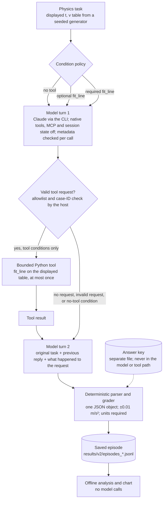

# Agentic Physics Bench

A reproducible evaluation of when a frontier model uses an available numerical tool, when it solves the task unaided, and how tool policy and task difficulty affect reliability. The system under test is Claude (`claude-opus-5`) behind the Claude Code CLI with its native tools switched off; the only tool is a bounded, allowlisted line-fit function dispatched by a Python harness. Every episode is saved, every reported number is recomputed from the saved episodes, and the protocol is hashed and frozen before any scored call.

> **V1 finding.** On 12 held-out tasks the system answered 12/12 correctly with no tool and 12/12 correctly with an optional exact line-fit tool available, and it requested that tool in **0/12** tool-enabled episodes. Every V1 task was solved without electing to use an available exact numerical tool. Both conditions hit the scoring ceiling, and why the tool went unrequested is not established. V2 turns that ceiling into the next experiment: make the tasks harder, give every condition the same two-turn budget, and separate no-tool, optional-tool and required-tool behaviour.

**Status (2026-09-23).** V1 released as tag `v1.0.0` and re-verified. V2 protocol frozen (`v2-run-1`); its 162-episode scored run has **not** been started. No number on this page is a scored V2 result.

## Reviewer quick path

- **60 seconds:** the finding above, the [V1 → V2 table](#v1--v2-at-a-glance) and the two diagrams below it.
- **5 minutes:** the [V1 result](#v1-what-was-observed-release-v100), the [evaluation-integrity finding](#evaluation-integrity-when-one-model-was-actually-two) and the [V2 design](#v2-task-difficulty--tool-policy-frozen-scored-run-pending).
- **Run offline (no model calls, standard library only):**
  ```bash
  python3 -m unittest tests.test_ls_slope tests.test_tasks tests.test_evaluate tests.test_agent tests.test_controls tests.test_analyze tests.test_v2_tasks tests.test_v2_agent tests.test_v2_run tests.test_v2_analyze tests.test_v2_pipeline && python3 src/analyze.py && python3 src/chart.py && python3 src/analyze_v2.py dev && python3 src/chart_v2.py dev
  ```
- **Raw evidence:** V1 [`results/episodes_scored.jsonl`](results/episodes_scored.jsonl) and [`results/summary.md`](results/summary.md); V2 development [`results/v2/episodes_dev.jsonl`](results/v2/episodes_dev.jsonl) and [`results/v2/summary_dev.md`](results/v2/summary_dev.md); archived development stages with audits under [`results/v2/`](results/v2/).
- **Protocols:** [`EXPERIMENT.md`](EXPERIMENT.md) (V1, frozen) and [`EXPERIMENT_V2.md`](EXPERIMENT_V2.md) (V2, frozen as `v2-run-1`).

## V1 → V2 at a glance

| Version | Question | Design | Observed / current status |
|---|---|---|---|
| **V1** (released `v1.0.0`) | On easy velocity–time tasks, does a bounded line-fit tool workflow change what the model gets right, and does the model choose to use it? | 12 held-out tasks (10 points, uniform grid); direct answer (1 call) vs optional `fit_line` (≤ 2 calls); ±0.01 m/s² of the least-squares slope; 24 scored episodes | **12/12 direct, 12/12 optional-tool, 0/12 optional-tool requests.** Ceiling; the reason for zero uptake is open |
| **V2** (frozen, on this branch) | As the same tasks get harder, how do no-tool, optional-tool and required-tool workflows affect correctness, tool uptake, relay fidelity and failure modes? | 18 held-out tasks in three difficulty levels (10 / 24 / 40 points; uniform / irregular grid; σ 0.5 / 1 / 2); no tool / optional / required, two calls in every condition; 3 repetitions; 162 scored episodes, 324 calls | **Scored result pending.** Development calibration (6 tasks) below is not held-out evidence |

Development calibration is kept strictly apart from the scored set: different seeds, its own files, and no claim beyond "the mechanism works".

## How an episode runs (V2)



The model only ever *proposes* an action as JSON text; the host validates it against the allowlist and executes it. The key file is read by the grader alone. A call whose metadata shows a native tool, an MCP server, another model, a server-side tool, overage or stderr output is invalid and stops the batch.

## From V1 to V2

```mermaid
flowchart LR
    subgraph V1["V1: easy task, optional tool (released)"]
        direction TB
        a["12 held-out tasks<br/>10-point uniform grid"] --> b["direct 12/12<br/>optional tool 12/12"]
        b --> c["optional tool requested 0/12"]
        c --> d["ceiling; zero uptake unexplained"]
    end
    subgraph V2["V2: difficulty x tool policy (frozen; scored run pending)"]
        direction TB
        e["harder tasks<br/>10 / 24 / 40 points, irregular grid, more noise"] --> f["equal two-turn budget<br/>in every condition"]
        f --> g["no tool / optional / required"]
        g --> h["3 repetitions per task<br/>162 episodes"]
        h --> i["tool uptake, correctness,<br/>relay fidelity, failure analysis"]
    end
    d --> e
```



V2 separates five things V1 could not: whether the harness executes the tool correctly (required condition), whether the model voluntarily requests it (optional condition), whether access to or use of the tool improves correctness as tasks get harder (required and optional vs no tool), whether the model uses the returned result correctly (relay fidelity), and how sensitive all of this is to difficulty and to prompt wording (three groups; a documented wording change during development).

## Next experiment

**Next:** run the frozen V2 held-out evaluation: 18 tasks × 3 conditions × 3 repetitions = 162 episodes / 324 bounded model calls.

Predefined outputs (`src/analyze_v2.py`, fixed before inference):

- correctness by difficulty × tool policy;
- voluntary tool-request rate;
- valid tool-execution rate;
- required-tool compliance;
- relay fidelity (final answer vs the tool's slope);
- numerical error;
- failure modes (invalid requests, execution failures, unparseable or wrong answers after execution, code-seeking replies, timeouts, invalid runs);
- within-task stochastic variation across repetitions;
- task-level paired comparisons and a task-clustered bootstrap for uncertainty;
- latency and actual model-call usage.

The scored tasks, answer keys, prompts, run plan and analysis rules are frozen before inference. If the result is another ceiling or the optional tool again goes unused, that result will be reported rather than redesigned away.

## V1: what was observed (release `v1.0.0`)

Twelve held-out cases of one task: ten (t, v) points, uniform 0.5 s grid, σ = 0.5 m/s, report the least-squares slope in m/s². Two conditions on the same cases: a direct answer (one call) and an optional `fit_line` workflow (the model may request the tool by case ID; the harness validates and runs it; a fresh second call gets the result). Scoring: ±0.01 m/s² of the least-squares slope of the displayed numbers, units required. Full protocol: [`EXPERIMENT.md`](EXPERIMENT.md).

| Condition | Correct | Tool requested | Model calls | Median / max \|error\| (m/s²) |
|---|---|---|---|---|
| Direct answer | **12/12** | — | 12 | 1.1 × 10⁻⁴ / 4.5 × 10⁻⁴ |
| Optional `fit_line` workflow | **12/12** | **0/12** | 12 | 2.1 × 10⁻⁴ / 1.5 × 10⁻³ |
| Deterministic least-squares solver (reference point) | 12/12 | — | — | 0 |


*What to notice: every point sits far below the tolerance line in both conditions, and there are no tool-workflow points that differ from direct-answer points because the tool was never requested. The chart shows a ceiling, not a tool effect.*

- **What this shows:** on this task the system reproduced the least-squares slope to within rounding in both conditions; given an optional exact tool, it never requested it.
- **What it does not show:** any effect of tool access (the tool was never exercised in a scored episode); that tools are unnecessary or unhelpful; why the tool went unrequested (the CLI's thinking blocks are redacted in the traces); anything about other tasks, harder problems or other models; that a language model is needed (an ordinary least-squares function solves the task exactly).
- **Re-verified 2026-09-23** in an isolated checkout of `v1.0.0`: 36 checks, byte-identical regeneration, 14 manifest hashes, every episode recounted and regraded, the dispatch branch driven end to end with scripted replies, and the saved traces scanned for any second model or server-side tool (none). Only limitation: the installed CLI is now 2.1.280 versus the frozen 2.1.278.

<details>
<summary>V1 details: architecture, how the model is used, failure review, limitations</summary>

### System architecture (V1)


*Purple: model call · blue: deterministic code · green: human · amber: evaluation · grey: storage · dashed: external, optional, mocked or planned*

As of v1.0.0, `src/tasks.py` writes seeded synthetic cases, and their reference slopes go to separate key files that neither the model nor the tool receives. `src/run.py` checks the freeze manifest before a scored batch and sends a prompt built from the displayed numbers to Claude through the Claude Code CLI: once in the direct condition, or through the bounded loop in `src/agent.py`, which validates any `fit_line` request and runs it at most once. Each call is checked against the controls, `src/evaluate.py` grades the parsed answer against the hidden key, and every episode is appended to `results/episodes_*.jsonl`. `src/analyze.py` and `src/chart.py` build the summary and chart from those saved traces without calling a model.

### How AI is used (V1)

- **Model and role:** Claude (`claude-opus-5`, requested effort `high`) through the Claude Code CLI 2.1.278, on a Claude subscription rather than an API key. It is the system under test; the harness makes no other model calls.
- **Input:** a prompt from `prompts/*.txt` filled with the case's displayed times and velocities. In the workflow's second call it also gets its previous reply and the `fit_line` result. It never sees the reference key.
- **Output:** exactly one JSON object, either a final answer or (workflow only) a `fit_line` request, parsed without repair or retry.
- **Tools and permissions:** the CLI's native tools, MCP servers and session persistence are off, and each call runs in safe mode in an empty temporary directory. The model can only request `fit_line`; the harness validates the request and executes it.
- **Deterministic or human-controlled:** case generation, the loop, control checks, grading, analysis and the chart are standard-library Python. Leo approved the protocol freeze, and after an invalid scored run no further inference happens until he decides.
- **Evaluation and limits:** answers must be within ±0.01 m/s² of the least-squares reference, with units.

### Failure review

- **Model errors in scored episodes: none.** The closest case is s-07 in the workflow condition: −3.6 against a reference of −3.601455 (error 1.5 × 10⁻³), consistent with rounding to 2 decimals.
- **Harness errors, found in review before scoring and reproduced independently:** a tool request with `"name": []` crashed validation with a TypeError; the runner could record a failed control alongside a correct grade. Both were fixed before the freeze; regression tests fail on the old code and pass on the fix (`tests/test_agent.py`, `tests/test_controls.py`).
- **Configuration hazard:** the CLI does not reject an unknown `--effort` value (stderr warning, default used, model still called), so the runner treats any stderr output as a control violation. No scored call produced stderr output.

### Limitations

12 cases and one system. The CLI adds its own instructions, which were not verified: results describe that system, not the bare model. `fit_line` returns exactly the reference, so tool use plus faithful copying would guarantee a correct answer; the optional wording let the model skip it. The effort setting can't be confirmed from traces, only the absence of the fallback warning. The CLI's reported input-token totals don't track prompt length. The prompts were fixed after two development episodes on dev-01.

</details>

## Evaluation integrity: when "one model" was actually two

**What was found.** During V2 development, a review of one raw CLI trace showed a server-side `advisor` tool that had consulted a second model, `claude-fable-5-1`, inside a call made with native tools disabled. An audit of the raw traces found it in 31 of the 48 calls of the first two development stages. In those calls the system under test was not `claude-opus-5` alone.

**Why it mattered.** V1's controls checked the CLI's tool list and each assistant message's model ID; a server-side tool and a second model appear only in the usage report (`modelUsage`, `server_tool_use` blocks, an `advisor_message` iteration), so those calls passed as valid. The contaminated stages looked like a comfortable ceiling (18/18 correct); the clean rerun did not, until the no-tool prompt was made explicit (see V2 below). A control that passed in one CLI version was blind to a feature present in the next.

**What was done.**

- The advisor is switched off by environment variable for every call, recorded in every episode and in the freeze manifest, and checked by `verify_freeze`.
- Three per-call controls were added: any server-side tool block, any model other than the declared one in the usage report, or any non-message iteration invalidates the episode and stops the batch (`src/run_v2.py`, with regression tests).
- The contaminated development stages were archived, not deleted, with per-episode audits: [`results/v2/dev_stage1/`](results/v2/dev_stage1/) and [`results/v2/dev_stage2/`](results/v2/dev_stage2/). They are excluded from the clean calibration.
- V1's 24 saved scored traces were rescanned: assistant content is thinking and text only, `modelUsage` lists `claude-opus-5` only, every usage iteration is a plain message. On the available evidence V1 remains valid.

This is a harness and control finding about what "no tools" must be verified against, not a claim about the provider's intent. Details: `RESEARCH_LOG.md`, entries "Control failure found" and "V2 development gate, stage 3".

## V2: task difficulty × tool policy (frozen; scored run pending)

Protocol: [`EXPERIMENT_V2.md`](EXPERIMENT_V2.md), frozen as run `v2-run-1` ([`data/v2/freeze_manifest.json`](data/v2/freeze_manifest.json): 21 hashed files, CLI 2.1.280, effort high, 600 s timeout, advisor disabled). Code: `src/tasks_v2.py`, `src/agent_v2.py`, `src/run_v2.py`, `src/analyze_v2.py`, `src/chart_v2.py`; prompts `prompts/v2/`; data `data/v2/`. V1's frozen files are untouched: V2 imports V1's reference function, tool, parser, grader, CLI adapter and control checks.

| | V1 | V2 | Why |
|---|---|---|---|
| Difficulty | one group | easy = V1's generator with a new seed; moderate = 24 points on an irregular grid (t = 0.5·i + U(0, 0.4) s), σ 1.0; hard = 40 points, irregular, σ 2.0 | make the unaided answer harder for a reason other than an arbitrary tolerance |
| Tolerance | ±0.01 m/s² | ±0.01 m/s², every group | same rule, harder data; a simulation shows that named shortcuts (endpoint slope, split-halves slope, a 10-point subsample, ignoring the time jitter) rarely pass in the harder groups; it does not exclude other approximate methods (`EXPERIMENT_V2.md` section 5) |
| Conditions | direct (1 call) vs optional tool (≤ 2 calls) | no tool, optional tool, required tool; **2 calls each**, ≤ 1 tool execution | the no-tool control gets the same chance to revise, so a tool effect is not confounded with an extra turn; the required condition tests the mechanism and relay fidelity |
| Repetitions | 1 | 3 | within-task variation; task-level paired analysis with a cluster bootstrap over tasks |
| Run plan | fixed alternation | seeded blocks; resume never repeats an episode | interruption leaves whole blocks complete |
| Controls per call | tool list, MCP list, model ID, native tool use, overage, stderr | the same, plus CLI version, no server-side tool, no second model, no non-message iteration | see the integrity finding above |

V2 is not a replication of V1: the CLI version, the two-turn design and the prompt wording differ. The easy group is the closest point of comparison.

### Development calibration (6 tasks, 2 per group; not the held-out result)


*What to notice: with the final prompts every bar is full, so the development set does not separate the conditions; it establishes that the mechanism works (the optional tool was requested and executed 6/6, required-tool compliance 6/6, every returned slope relayed exactly) and that the unaided system returned answers inside tolerance on the 40-point tasks when told explicitly that no tools exist. How it produced them is not observed: the CLI redacts the model's reasoning, so only the returned values and token counts are recorded. Six tasks support no statistical claim.*

| Group (points) | No tool, final wording | No tool, earlier wording (stage 3) | Optional tool (requested) | Required tool (compliant) |
|---|---|---|---|---|
| easy (10) | 2/2 | 2/2 | 2/2 (2) | 2/2 (2) |
| moderate (24) | 2/2 | 1/2 | 2/2 (2) | 2/2 (2) |
| hard (40) | 2/2 | 0/2 | 2/2 (2) | 2/2 (2) |

Two development observations shaped the frozen protocol and are kept as findings:

- **Prompt sensitivity of the no-tool condition.** Under the earlier wording, every moderate and hard first reply was an attempt to run code the system does not have (a fenced bash block or tool-call syntax), and the second-turn numbers were outside tolerance on 3 of 4. With the explicit sentence "No tools or code execution are available. Compute the answer from the table." the system returned every answer inside tolerance without a tool (median thinking tokens per call 642 / 2,130 / 6,368 by group); whether it performed the full regression, used an approximation that lands inside ±0.01, or something else is not observable from the traces. The scored no-tool baseline uses the explicit sentence, chosen before the freeze; the earlier stage is archived in [`results/v2/dev_stage3/`](results/v2/dev_stage3/). Grader, tolerance and tasks were not changed on any development outcome.
- **The second-model contamination** described above (stages 1–2).

Table view with errors, latency, thinking tokens and the failure taxonomy: [`results/v2/summary_dev.md`](results/v2/summary_dev.md).

## Reproduce without model calls

Python 3.11, standard library only. The command in the reviewer quick path runs all 90 checks and regenerates the V1 and V2 summaries and charts; regenerating the data (`python3 src/tasks.py`, `python3 src/tasks.py scored`, `python3 src/tasks_v2.py`, `python3 src/tasks_v2.py scored`) leaves every committed file unchanged. The same checks run in CI ([`.github/workflows/checks.yml`](.github/workflows/checks.yml)). Scored inference needs a Claude subscription with the frozen CLI version; `src/run.py scored-batch` and `src/run_v2.py scored-batch` refuse to run unless every frozen file and the CLI version match their manifest, and never repeat an attempted episode. Raw CLI output (`results/raw/`) is not published because it contains session metadata; the reviewed per-call summaries are in the episode files, with paths redacted.

## Repository map

| Path | What |
|---|---|
| `EXPERIMENT.md`, `data/freeze_manifest.json` | V1 frozen protocol and manifest |
| `EXPERIMENT_V2.md`, `data/v2/freeze_manifest.json` | V2 protocol, development gate record, decisions, and the `v2-run-1` freeze |
| `src/tasks.py`, `tools.py`, `evaluate.py`, `models.py`, `agent.py`, `run.py`, `analyze.py`, `chart.py` | V1 (frozen) |
| `src/*_v2.py`, `prompts/v2/`, `data/v2/`, `results/v2/` | V2; `results/v2/dev_stage1/`–`dev_stage3/` are archived development snapshots (stages 1–2 with advisor audits) |
| `results/episodes_scored.jsonl`, `results/summary.*`, `results/chart.svg` | V1 evidence and analysis outputs |
| `tests/` | 90 offline checks, including an end-to-end pipeline test (task → model choice → tool request → validated execution → returned result → final answer → deterministic score) and regression tests for every defect found in review |
| `RESEARCH_LOG.md`, `HANDOFF.md`, `RESEARCH_ROADMAP.md` | chronology, evidence and follow-ups |
| branch `research/analytical-physics` | a separate analytical-physics study proposal; unapproved, unrun, not part of this branch |

## Provenance

Research question, design decisions, protocol approvals and publication: Leo (@retinapeg). Implementation, tests and documentation were produced with Claude Code at Leo's direction; each source file carries its provenance line. Independent review: Codex (V1: two harness defects reproduced; V2: three executable defects) and a multi-agent review (V2: the second-model finding and ten further defects), each fix carrying a regression test. The chronology and evidence are in [`HANDOFF.md`](HANDOFF.md) and [`RESEARCH_LOG.md`](RESEARCH_LOG.md).
