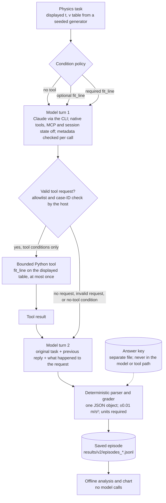

# Agentic Physics Bench

An empirical study of how tool availability and tool-use policy affect a language model's correctness and behaviour on numerical physics tasks. Each model call's trace is audited to check that the system evaluated was the system declared.

**Status: completed and frozen (September 2026).** Two experiments, V1 and V2, ran on `claude-opus-5` through the Claude Code CLI. Each protocol was frozen before its scored run, and every number below is recomputed from committed records by `python3 src/headline_results.py`. Follow-on agent-reliability work is planned for a separate repository, `agent_reliability_lab` ([status](docs/HISTORICAL_STATUS.md)).

## Key findings

- **A trace audit found a second model inside "no-tool" calls.** During V2 development, a server-side `advisor` tool in the Claude Code CLI consulted a second model, `claude-fable-5-1`, in **31 of 48 model calls** (21 of 24 episodes) of the first two development stages. The CLI's tools were switched off at the time. The harness's per-call controls passed these calls as valid, because the second model appeared only in the usage metadata. Those stages were voided and archived, the feature was disabled, and three per-call checks were added. All 324 held-out calls and the 48 later development calls show `claude-opus-5` alone. *(Development data; the held-out run is not affected.)*
- **Held-out correctness hit the ceiling in every condition.** V2's frozen run had **162 episodes**: 18 held-out tasks × 3 tool policies × 3 repetitions, with 324 calls and 0 invalid episodes. It scored **54/54** with no tool, **54/54** with an optional tool and **54/54** with a required tool. Every task-level paired difference is zero, so the study measured no effect of tool access on accuracy, positive or negative. V1 (24 episodes on easier tasks) was also at the ceiling: 12/12 in both conditions.
- **Tool policy changed behaviour, not accuracy.** Offered an optional line-fit tool, the model requested it in **54/54** V2 episodes. In V1 it had requested the same tool **0/12** times. Every executed tool result was relayed within tolerance (108/108). Without a tool, median time per call and CLI-reported thinking tokens rose with difficulty (10 → 26 → 55 s; 621 → 2,298 → 5,314 tokens). With a tool, they were about 5 s and 0. The design cannot attribute the 0/12 → 54/54 change to any one cause (see [below](#what-these-results-do-not-show)).
- **The no-tool baseline was sensitive to prompt wording.** In clean development under the earlier wording, every moderate and hard no-tool first reply (4/4) tried to run code the system did not have. Final answers were correct on 2/2, 1/2 and 0/2 tasks by difficulty. With the explicit sentence "No tools or code execution are available", all 6 were correct, and that wording was frozen for the held-out run. *(6 development tasks; no statistical claim.)*

## Why this matters

An agent evaluation reports a score for a declared system: a model, a harness and a set of permitted tools. If the runtime quietly adds capability, such as a hidden tool, a second model or an extra turn, the score measures a different system, and the aggregate gives no sign of it. Here the contaminated development stage looked like a clean ceiling result (18/18 correct). The first run with the second model switched off did not (no tool 3/6). The prompt wording had also changed in between, so that difference is not attributed to the advisor alone. Controls that were adequate for the V1 traces did not look for the signals this feature leaves.

The project therefore treats each call's trace as primary evidence, not the score. Every call is checked against the declared system:

- the model identities in the usage report
- server-side tool blocks and usage iterations
- the CLI version
- native tool use and stderr output

Any mismatch makes the episode invalid, keeps it in the denominator and stops the batch.

## Experiment

| | V1 (tag `v1.0.0`) | V2 (tag `v2.0.0`, run `v2-run-1`) |
|---|---|---|
| Question | On easy tasks, does an optional line-fit tool change what the model gets right, and does the model choose to use it? | As tasks get harder, how do no-tool, optional-tool and required-tool policies affect correctness, tool uptake, relay fidelity and failure modes? |
| Held-out tasks | 12 tables: 10 points, uniform time grid, noise σ 0.5 m/s | 18 tables in three groups: 10 / 24 / 40 points; uniform / irregular / irregular grid; σ 0.5 / 1 / 2 m/s |
| Conditions | direct answer (1 call); optional `fit_line` (≤ 2 calls) | no tool, optional `fit_line`, required `fit_line`; exactly 2 calls each; 3 repetitions |
| Held-out episodes / calls | 24 / 24 | 162 / 324 |
| System under test | `claude-opus-5`, Claude Code CLI 2.1.278 | `claude-opus-5`, Claude Code CLI 2.1.280, server-side advisor disabled |

- **Task.** Each task is a table of time and velocity readings. The answer is the acceleration, i.e. the least-squares slope in m/s². It is correct if it is within ±0.01 m/s² of the least-squares slope of the displayed numbers and carries units. Answer keys sit in separate files that neither the model nor the tool receives.
- **Agent and tool.** The model has no native tools, MCP servers or session memory, and each call runs in an empty temporary directory. It can only *propose* an action, as one JSON object. The Python harness validates the proposal against an allowlist and runs the one tool, `fit_line` (a deterministic least-squares fit of the displayed table), at most once per episode.
- **Traces.** Every call's full CLI event stream is saved. A reviewed per-call summary goes into the committed episode records: model IDs, token counts, latency, tool blocks and violations.
- **Protocol.** Before any scored call, the tasks, keys, prompts, run plan and harness code were hashed into a freeze manifest (V2's also covers the analysis code). The runners refuse to start if anything differs. Development and held-out tasks use different seeds and files.
- **Exclusions.** A control violation makes the episode `invalid_run`: it stays in the denominator and the batch stops. Timeouts, malformed output and refusals are graded outcomes. No held-out episode was excluded, repeated or added, and neither held-out run had an invalid episode or a timeout.

## Results

### Held-out runs

| | V1 | V2 |
|---|---|---|
| Correct (±0.01 m/s², units required) | direct **12/12**; optional **12/12** | no tool **54/54**; optional **54/54**; required **54/54** |
| Optional tool requested | **0/12** | **54/54** (18/18 in each difficulty group) |
| Required-tool compliance | — | **54/54** |
| Executed tool results relayed within tolerance | — (never executed) | **108/108** |
| Tasks with mixed outcomes across repetitions | — (1 repetition) | 0 in every condition |
| Median s per call, no tool (easy / moderate / hard) | — | 10 / 26 / 55 (tool conditions: 5) |
| Median reported thinking tokens per call, no tool | — | 621 / 2,298 / 5,314 (tool conditions: 0) |
| Deterministic least-squares solver (reference point) | 12/12 | 18/18 |


*Every bar is full: a ceiling result that does not separate the conditions on correctness.* Full tables: [`results/summary.md`](results/summary.md) (V1) and [`results/v2/summary_scored.md`](results/v2/summary_scored.md) (V2).

### Trace audit across V2 development (2026-09-23)

| Development stage | Calls | Calls with a second model | Status |
|---|---|---|---|
| 1: full development plan, 18 episodes, original wording | 36 | 24 | void; archived with its audit ([`dev_stage1/`](results/v2/dev_stage1/)) |
| 2: 6 hard episodes rerun (12 calls) + 12 episodes carried over from stage 1 | 36 | 25 | void; archived with its audit ([`dev_stage2/`](results/v2/dev_stage2/)) |
| **Stages 1–2, unique calls** | **48** | **31** | |
| 3: full plan rerun, advisor disabled, new checks enforced | 36 | 0 | clean; no-tool records superseded by the wording decision ([`dev_stage3/`](results/v2/dev_stage3/)) |
| 4: the 6 no-tool episodes with the final wording | 12 | 0 | clean; with stage 3's tool records, the final development set |
| Held-out run `v2-run-1` | 324 | 0 | scored |

Stages 1–4 account for 96 of the 98 development calls. The other two, a smoke check and the probe that confirmed the switch, are recorded in [`EXPERIMENT_V2.md`](EXPERIMENT_V2.md) section 9. The raw traces behind the audit are not published because they contain session metadata. The committed per-call audit files are published, and [`results/RESULTS_MANIFEST.md`](results/RESULTS_MANIFEST.md) explains what can be checked without the raw traces.

## What these results do not show

- **Any effect of tool access on accuracy.** Every held-out condition was at the ceiling. The cluster-bootstrap intervals for the paired differences collapse to [0, 0]. That describes these data; it does not establish that the conditions are equivalent.
- **How the unaided answers were computed.** The CLI redacts the model's reasoning. A correct answer shows that the returned number was within ±0.01 of the reference, not that a full regression was carried out.
- **Compute or cost.** Latency is observed wall-clock time per call, and thinking tokens are the CLI's report. Neither measures total internal computation. 0 reported thinking tokens does not show that no reasoning took place.
- **Why optional-tool uptake went from 0/12 to 54/54.** V2's easy group reuses V1's generator and still requested the tool 18/18. Between the runs, the CLI version, one turn-1 prompt parenthetical, the advisor setting, the two-turn structure, the tasks and the date all changed. The design does not isolate any one of them.
- **Anything beyond this system and task family.** The study covers one model behind one CLI, one family of synthetic line-fitting tasks and small held-out sets (12 and 18 tasks). The CLI adds its own instructions, so results describe the model-plus-CLI system, not the bare model. An ordinary least-squares function solves every task exactly. The study measures how reliably an LLM system performs a specified calculation, not whether an LLM is needed for it.
- **Anything about the provider's intent.** The advisor finding is about harness controls: what "no tools" had to be verified against in that CLI version.

## Reproduce the analysis

These commands need Python 3.11 with the standard library only, and make no model calls:

```bash
python3 -m unittest discover -s tests
python3 src/headline_results.py
python3 src/analyze.py && python3 src/chart.py && python3 src/analyze_v2.py scored && python3 src/chart_v2.py scored && python3 src/analyze_v2.py dev && python3 src/chart_v2.py dev
git status --short results/
```

1. The first command runs the offline test suite.
2. The second recomputes every number in this README from the committed episode records and audit files, and exits non-zero on any mismatch.
3. The third regenerates the summaries and charts.
4. The fourth prints nothing when the regenerated files are byte-identical to the committed ones.

CI runs all of this, plus a check that every frozen file matches its release tag ([`.github/workflows/checks.yml`](.github/workflows/checks.yml)). Rerunning the model calls would need the frozen CLI version and a Claude subscription, and no number here depends on it.

## How an episode runs (V2)


```mermaid
flowchart TD
    T["Physics task<br/>displayed t, v table from a seeded generator"] --> P{"Condition policy"}
    P -->|no tool| M1
    P -->|optional fit_line| M1
    P -->|required fit_line| M1
    M1["Model turn 1<br/>Claude via the CLI; native tools, MCP and session state off; metadata checked per call"] --> Q{"Valid tool request?<br/>allowlist and case-ID check by the host"}
    Q -->|yes, tool conditions only| X["Bounded Python tool<br/>fit_line on the displayed table, at most once"]
    X --> R["Tool result"]
    R --> M2
    Q -->|no request, invalid request, or no-tool condition| M2["Model turn 2<br/>original task + previous reply + what happened to the request"]
    M2 --> G["Deterministic parser and grader<br/>one JSON object; ±0.01 m/s²; units required"]
    K[("Answer key<br/>separate file; never in the model or tool path")] -.-> G
    G --> E[("Saved episode<br/>results/v2/episodes_*.jsonl")]
    E --> A["Offline analysis and chart<br/>no model calls"]
```

The model only ever *proposes* an action as JSON text; the host validates it against the allowlist and executes it. The key file is read by the grader alone. Every condition gets exactly two calls, so a tool effect cannot be confounded with an extra turn. The required condition is a diagnostic of the mechanism and relay fidelity, not of voluntary tool use.

## Documentation

| Document | Contents |
|---|---|
| [`docs/methodology.md`](docs/methodology.md) | design, controls, exclusion rules, statistics, and which conclusions are and are not supported |
| [`results/RESULTS_MANIFEST.md`](results/RESULTS_MANIFEST.md) | canonical runs, raw versus derived files, and the evidence behind each number |
| [`EXPERIMENT.md`](EXPERIMENT.md), [`EXPERIMENT_V2.md`](EXPERIMENT_V2.md) | the frozen protocols, including V2's development-gate and run records |
| [`RESEARCH_LOG.md`](RESEARCH_LOG.md) | dated chronology of decisions, runs and corrections |
| [`docs/HISTORICAL_STATUS.md`](docs/HISTORICAL_STATUS.md) | freeze status, tags, and where future work goes |
| [`RESEARCH_ROADMAP.md`](RESEARCH_ROADMAP.md) | hypotheses and deferred follow-ups as recorded during the study |

## Repository map

| Path | What |
|---|---|
| `src/tasks.py`, `tools.py`, `evaluate.py`, `models.py`, `agent.py`, `run.py`, `analyze.py`, `chart.py` | V1: generator, tool, grader, CLI adapter, bounded loop, runner, analysis (frozen) |
| `src/*_v2.py` | V2: generator, two-turn loop, runner with the added trace checks, analysis (frozen) |
| `src/headline_results.py` | recomputes the published headline numbers (added at the freeze; no model calls) |
| `data/`, `data/v2/` | tasks, hidden keys, run plans, freeze manifests |
| `prompts/`, `prompts/v2/` | frozen prompt templates |
| `results/`, `results/v2/` | episode records, summaries and charts; `results/v2/dev_stage1/`–`dev_stage3/` are archived development stages |
| `tests/` | offline tests, including an end-to-end pipeline test with a scripted CLI and a regression test for every defect found in review |
| `docs/` | methodology, historical status, V1 architecture diagram |

## Provenance

Leo (@retinapeg) did the research work:

- set the research questions
- made the design and protocol decisions (V1 decisions D1–D10; V2 section 11, including the no-tool wording V2-4b)
- approved each freeze before its scored run
- decided what to publish

The code, tests and documentation were written by Claude (Claude Code) at Leo's direction. Before each freeze the harness went through independent code review. The V1 review reproduced two harness defects. The V2 review found three executable defects, and then a multi-agent review found the second-model contamination and ten further defects. Every fix carries a regression test. Chronology: [`RESEARCH_LOG.md`](RESEARCH_LOG.md).
